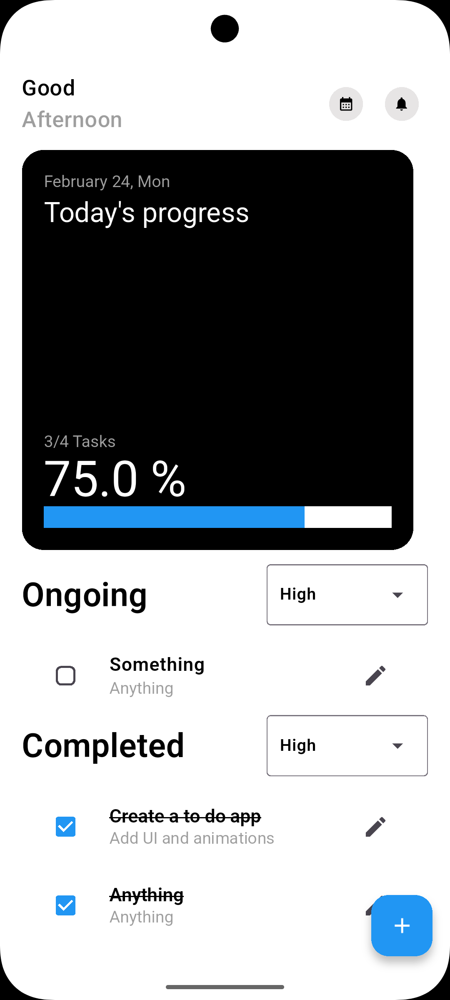

Here's your README file:  

---

# 📝 Hive To-Do App  

A simple yet efficient **To-Do App** built using **Hive** for local storage, **GetX** for state management, and **Lottie** for smooth animations. 🚀  

## 📌 Features  
✅ Save, delete, and update tasks  
✅ Filter tasks based on priority  
✅ Animated UI with **Lottie**  
✅ Track task completion progress  

## 🛠️ Tech Stack  
- **Flutter** 💙  
- **Hive** (Local Database) 🗂  
- **GetX** (State Management) ⚡  
- **Lottie** (Animations) 🎨  

## 📸 Screenshots  



## 📥 Installation  
1. Clone the repository:  
   ```bash
   git clone https://github.com/Syed722528/hive_todo_app.git
   ```
2. Navigate to the project directory:  
   ```bash
   cd hive_todo_app
   ```
3. Install dependencies:  
   ```bash
   flutter pub get
   ```
4. Run the app:  
   ```bash
   flutter run
   ```  

## 📧 Contact  
If you have any questions or suggestions, feel free to reach out! 🚀  

---  
